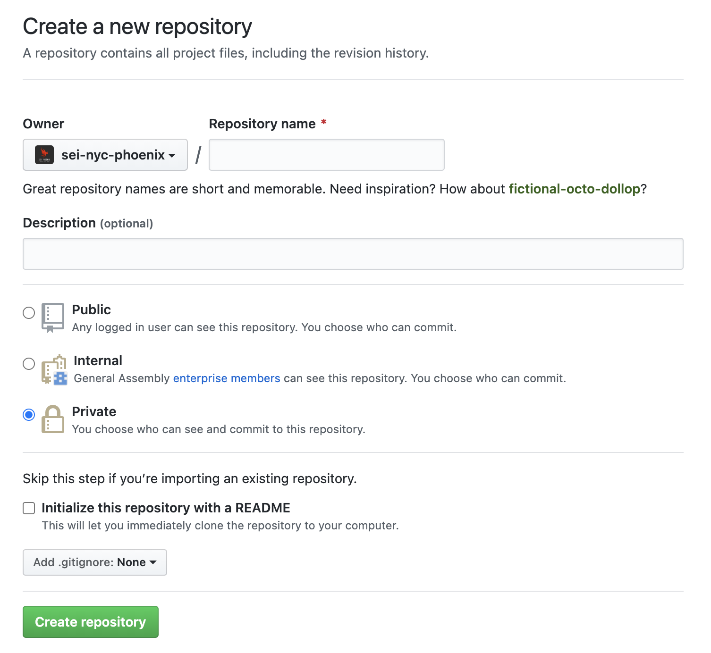
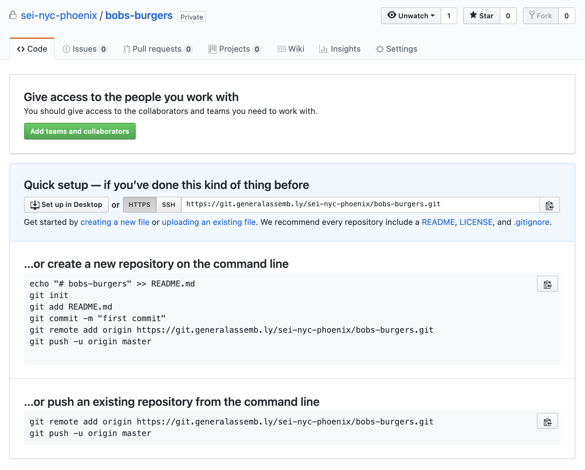

#  SOFTWARE ENGINEERING IMMERSIVE

## Intro to GitHub

  

### Lesson Objectives

GitHub is one of the backbones of the industry. It will become one of your most-visited websites in no time, so let's use our work from the Intro to Git Lesson to explore it a little more.

By now, you've probably heard all the GitHub keywords, at least in passing– local versus remote; forking, cloning, branching, and stashing; pull requests, merging, and merge conflicts; issues; wikis; projects; tags, shields

By the end of this lesson, you will be a little more comfortable with:

-   The GitHub UI (user interface).
-   Forking and cloning a _remote_ repository.
-   Syncing _local_ and _remote_ repositories.
-   Collaborating with teams and colleagues on the same project.
-   Opening _pull requests_ (how we submit homework).

 

## Working with GitHub

We've already learned about git and created a _local_ repository, but what about a _remote_ repository?

First, we should clarify: GitHub **did not** create git. Git was created by
Linus Torvald (the same guy who created Linux) and is an open source project.
GitHub is a Software-as-a-Service product built around git.

Developers use GitHub for everything (which is why we use it for everything).

To work with GitHub, we'll need the following commands:

| Command      | Description                                    |
| ------------ | ---------------------------------------------- |
| `git remote` | adds a remote repository to a local repository |
| `git push`   | pushes local changes to the remote repository  |
| `git pull`   | pulls changes from a remote repository         |

  

#### Remote Repositories

A remote repository is just another repository, but it doesn't live on your computer, like your local repository, it lives in the cloud– in our case, on GitHub.

As long as you have the necessary permissions on the remote repository, you can manage the code _push_ code up to it, and _pull_ code down from it.

 

#### Introducing GitHub

At its core, remote repositories are cloud backups of our code.

Comparable to cloud storage apps like Google Drive, Microsoft OneDrive, and DropBox, there are alternatives to GitHub, but GitHub has become the most commonly used because of its stellar graphical interface and useful collaboration features.

For these reasons, it's become integral to collaboration, and most software engineering teams depend on it.

 

### Code Along, Part 3

#### Create a Remote Repository

-   Open your GitHub Enterprise.
-   Click the plus sign in the menu and select "new repository." _What does the new repo screen allow you to do?_

-   For clarity, we'll enter the same name that we used for our local version– `bobs-burgers`– but know that your local and remote repositories don't need to match exactly.
-   We'll set it to `public` and we won't initialize with a README or a `.gitignore`, since we already have those in our local repo.

#### Connect Your Local Repository

Once you create a fresh, empty remote repository, you'll see this screen:

We already have our local repository, so we'll use **the third option**, "push an existing repository from the command line."

-   Copy the **first** line under this option.
-   Open Terminal, and confirm you're in the correct repo with `pwd`.
-   First, run `git remote -v`. _What does it say?_
-   Now paste the command into terminal and hit enter.
-   Run `git remote -v` again. _What did these commands do?_

Boom, it's connected... But we still can't see our files on GitHub, right?

Now, let's grab that second line, and run it as well. _What just happened?_

 

---

### Some Explanations

#### Forking

A fork is a _copy_ of a repository. Forking a repository allows you to freely experiment with changes without affecting the original project. Forks are used mostly to either propose changes to someone's project, or to use someone's project as _starter code_ for your own idea.

#### Cloning

When you create a new repository on GitHub, it exists only as a remote repository. If you aren't connecting it to an existing local repository, you clone your repository "down" to create _a local copy_ on your computer and sync between the two locations.

#### Pushing To

When you created a local repository, then a remote repository, and then connected them, making that connection doesn't automatically add the content of your local repository. You have to push your local repository to your remote repository. (This is also how you ensure your code is backed up, in case your hard drive has any issues.)

We can do this by running `git push origin master`.

#### Pulling From

Sometimes, this will be the opposite– if there are any changes to your GitHub repository, such as making changes directly on GitHub, your local repository will be _behind_ the remote repository. We need to get the latest code off of GitHub.

We can do this by running `git pull origin master`.

(Git pull is actually combination of `git fetch` and `git merge`.) This gets the latest copy of our code from the master branch of our original repository.

#### Pull Requests

Once there are changes to any repositories, a pull request lets you notify others about the changes you've committed and pushed to that repository. Once a pull request is opened, you can view line-by-line comparisons, discuss any changes, approve the changes with collaborators, and even add more commits to the same repository before they are merged into the base branch.

> Check out this [Pull Request Tutorial](https://help.github.com/en/github/collaborating-with-issues-and-pull-requests/creating-a-pull-request) for more.

#### Merge Conflicts

Sometimes, if the same file has been edited on multiple different collaborators' local copies, attempting a PR or pulling their code will create a _merge conflict_. Let's not worry about that for now– we'll return to discuss it in Unit 3, when we have a group project to test this all out.

#### The .gitignore File

With each project, you'll often utilize _dependencies_ that are automatically installed and publicly available– these dependencies can be quite large, and because they're publicly available, we don't want to burden our remote GitHub repo. We use the _gitignore_ to ignore large and unneeded files and folders.

Remember running `npm i` on your first homework? This is because we needed a testing dependency that is installed on your project in what's called `node modules`. By ignoring these, it separates concerns about dependencies, including local environment variations, from the project itself.

 

---

### Recap

Your most common git flow– and how you will get, complete, and submit your homework – will look like this:

-   `fork`
-   `clone`
-   Make changes to a file.
-   `git add <filename>` or `git add .`
-   `git commit -m "with a commit message"`
-   `git push <remote name> <branch name>`
-   Then go to GitHub and `create pull request`.

 

Ultimately, GitHub can be... frustrating.

You'll shout at your computer.

  

You'll want to bang your head on a wall.

  

During project week, there might even be tears.

  

But soon enough, it will become second nature, and on that day, you'll love it.

  

---

### Want more practice?

Self-Guided Learning

 

The last time we saw the Belcher family, Linda went to the dinner theater. Let's add Gene to take her place.

  

-   Create a `gene.txt` file and add: `This is me now!`.
-   Add, commit, and push this file to GitHub.

#### And Louise too!

  
  

This time, let's use GitHub.

-   Go to your remote `bobs-burgers` repo on GitHub and click on "create new file".
-   Create a `louise.txt` file.
-   Add `You could sell your soul! I did, and look at me... I'm fine.`
-   Commit the file.

Return to your local repo, and this time, pull down the code.

